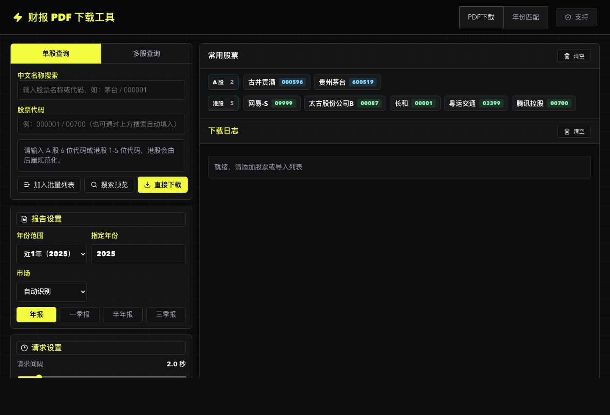
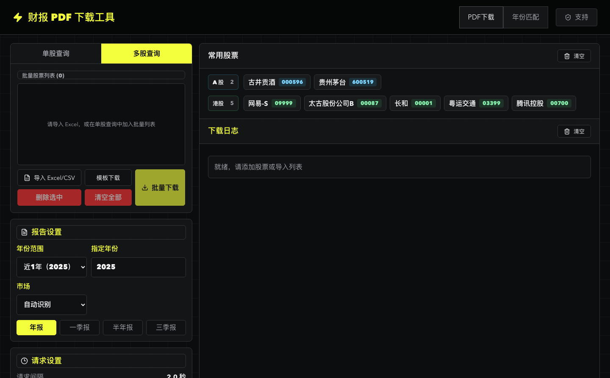
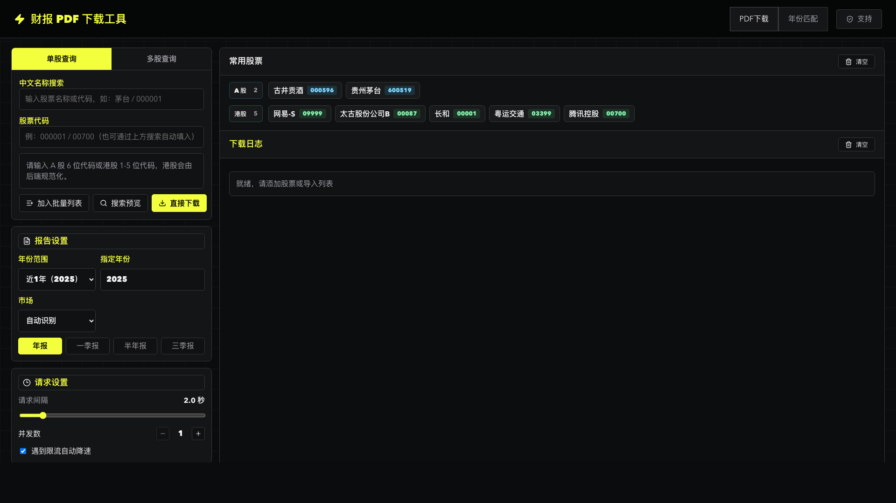

# AKReport

面向 A 股、港股投资研究的本地财报 PDF 批量下载工具。


AKReport 基于 [AKShare](https://github.com/akfamily/akshare) 生态和公开披露数据源，帮你把上市公司的年报、季报检索出来，按公司、年份、报告类型批量下载到本地目录。它适合投研资料归档、NotebookLM/知识库投喂、财务分析前的数据准备，也适合需要长期保存 PDF 原文的个人投资者。

> 项目使用公开数据源，强调源站友好访问：默认低并发、可调请求间隔、自动降速，不做暴力抓取。
> AKReport 是独立开源项目，不是 AKShare 官方项目。

## 界面预览

### 主工作台



### 批量下载



### 宽屏视图



## 主要功能

- 支持 A 股、港股公司财报检索与下载。
- 支持年报、一季报、半年报、三季报。
- 支持单股下载、批量股票列表、Excel/CSV 导入。
- 支持近 1 年、近 5 年、近 10 年批量年份模式。
- 实时下载日志、任务结果表、失败重试。
- 常用股票按 A 股/港股分区展示，自动补全股票名。
- 下载文件自动命名：`市场_代码_公司_年份_报告类型_公告日期.pdf`。
- 年报小文件保护：默认跳过小于 1MB 的年报候选，避免误下通知信函。
- 源站保护：请求间隔可调、并发受限、失败自动退避。
- 跨平台启动脚本：macOS/Linux 使用 `startup.sh`，Windows 使用 `startup.bat`。

## 功能亮点

### 面向投研归档的批量工作流

很多工具能查单家公司公告，但真正做投研资料整理时，常见需求是“几十家公司 × 多个年份 × 多种报告类型”。AKReport 从一开始就围绕批量归档设计：

- 一次选择近 1 年、近 5 年或近 10 年。
- 一次选择年报、一季报、半年报、三季报。
- 支持 Excel/CSV 导入股票池。
- 每个任务项独立成功、失败或跳过，单个失败不会中断整个批次。

### 更稳的报告匹配

财报公告里经常混有摘要、英文版、更正版、通知信函、股东大会材料。工具会对候选公告打分和过滤：

- 优先完整报告，避免误选摘要。
- 港股年报会降低“通知信函、通函、大会通告、代表委任表格”等伴随材料权重。
- 年报默认过滤小于 1MB 的 PDF，减少误下通知函。
- 标题明确属于其他年份时不会被错配到目标年份。

### 源站友好的下载策略

批量下载最怕“快一时，挂全局”。项目默认采取保守策略：

- 默认单并发。
- 请求间隔可在界面调整。
- 后端强制最小请求间隔。
- 连续失败会自动退避降速。
- 所有请求经过统一限速器，减少对公开源站的压力。

### 本地优先，结果可追踪

工具运行在你自己的电脑上，下载结果直接保存到本地目录：

- 文件名包含市场、代码、公司名、年份、报告类型和公告日期。
- `.partial` 临时文件写入，校验通过后再原子重命名。
- 已存在文件默认跳过，避免重复覆盖。
- 实时日志和任务结果表能看到每个股票的处理状态。

### A 股、港股体验细节

- A 股代码自动规范为 6 位。
- 港股代码自动规范为 5 位。
- 常用股票会按 A 股/港股分区展示。
- 股票名称优先用源站股票字典校正，避免历史记录显示错名。

## 为什么做这个项目

手动下载财报很琐碎：打开公告网站、搜索公司、筛年份、避开摘要和通知信函、保存并改名。批量做几十家公司、十年数据时尤其痛苦。

AKReport 的目标是把这条链路做成一个本地工具：

1. 输入股票代码或导入表格。
2. 选择年份和报告类型。
3. 让工具自动检索、匹配、下载、命名和记录结果。

它不是行情软件，也不提供投资建议。它只专注一件事：把公开披露的财报 PDF 稳定、克制、可追踪地保存到你的电脑。

## 快速开始

### 环境要求

- Python `3.11+`
- Node.js `18+`
- npm
- Git

后端 Python 依赖主要包括：

- `fastapi`
- `uvicorn`
- `pydantic`
- `pydantic-settings`
- `httpx`
- `akshare`
- `pandas`
- `openpyxl`

前端依赖主要包括：

- `react`
- `react-dom`
- `lucide-react`
- `vite`
- `typescript`
- `vitest`

完整依赖以 [backend/pyproject.toml](backend/pyproject.toml) 和 [frontend/package.json](frontend/package.json) 为准。

### 安装依赖

macOS / Linux:

```bash
git clone https://github.com/wasabihu/AKReport.git
cd AKReport

python3 -m venv .venv
source .venv/bin/activate
pip install --upgrade pip
pip install -e ./backend

cd frontend
npm install
cd ..
```

Windows PowerShell:

```powershell
git clone https://github.com/wasabihu/AKReport.git
cd AKReport

py -3.11 -m venv .venv
.\.venv\Scripts\Activate.ps1
python -m pip install --upgrade pip
pip install -e .\backend

cd frontend
npm install
cd ..
```

### macOS / Linux

```bash
./startup.sh start
```

打开：

```text
http://127.0.0.1:5173
```

常用命令：

```bash
./startup.sh status
./startup.sh stop
./startup.sh restart
```

### Windows

```bat
startup.bat start
```

打开：

```text
http://127.0.0.1:5173
```

Windows 默认下载目录：

```text
C:\reports
```

## 使用方式

### 单股下载

1. 在「单股查询」输入股票代码，例如 `600519`、`000001`、`00700`。
2. 选择市场、年份范围和报告类型。
3. 点击「搜索预览」检查匹配结果，或点击「直接下载」。

### 批量下载

1. 切换到「多股查询」。
2. 手动添加股票，或导入 Excel/CSV。
3. 设置请求间隔和并发数。
4. 点击「批量下载」。

Excel/CSV 支持常见列名：

- 股票代码：`股票代码`、`代码`、`code`、`stock_code`、`证券代码`、`symbol`
- 股票名称：`股票名称`、`名称`、`name`、`stock_name`、`证券名称`

## 技术架构

```text
frontend/     React + TypeScript + Vite
backend/      FastAPI + SQLite + async worker queue
AKShare       开源财经数据接口生态
docs/         产品、前端、后端、开发规范文档
startup.sh    macOS/Linux 一键启动脚本
startup.bat   Windows 一键启动脚本
```

后端负责：

- 公告检索与候选评分。
- 基于 AKShare 生态和公开公告接口组织数据访问。
- 股票代码、市场、名称规范化。
- 任务队列、限速、自动退避。
- PDF 下载、校验、原子落盘。
- SQLite 任务历史和常用股票记录。

前端负责：

- 深色桌面工具风格 UI。
- 单股/多股查询表单。
- 搜索预览、实时日志、任务结果表。
- 常用股票分区展示。
- 设置持久化和文件导入。

## 开发

后端：

```bash
cd backend
source ../.venv/bin/activate
PYTHONPATH=. uvicorn app.main:app --reload --port 8000
```

前端：

```bash
cd frontend
npm install
npm run dev
```

测试：

```bash
cd backend
source ../.venv/bin/activate
PYTHONPATH=. pytest app/tests/ -q

cd ../frontend
npm test -- --run
npm run build
npm run lint
```

## 文档

- [产品与总体开发文档](docs/财报PDF下载工具开发文档.md)
- [后端开发文档](docs/后端开发文档.md)
- [前端开发文档](docs/前端开发文档.md)
- [开发规范](docs/开发规范.md)
- [项目进度记录](docs/项目进度.md)

## 路线图

- [x] A 股、港股财报下载 MVP。
- [x] 批量下载、Excel/CSV 导入、实时日志。
- [x] 常用股票分区展示和股票名自动校正。
- [x] 年报小文件保护，避免误下通知信函。
- [ ] 下载历史搜索与筛选。
- [ ] 更完整的港股官方源 fallback。
- [ ] 应用打包发布。
- [ ] GitHub Actions 自动测试。

## 开源致谢

本项目使用并受益于 [AKShare](https://github.com/akfamily/akshare) 开源财经数据接口生态。AKShare 是由 AKFamily 维护的 Python 金融数据接口库，项目介绍中称其目标是简化金融数据获取流程。

如果你也在做量化研究、投研自动化或财经数据分析，建议关注 AKShare 上游项目和文档：

- GitHub: [akfamily/akshare](https://github.com/akfamily/akshare)
- Documentation: [akshare.akfamily.xyz](https://akshare.akfamily.xyz)

## 数据源与免责声明

本项目基于 AKShare 生态和公开披露信息构建，不提供投资建议，也不保证第三方数据源的完整性。实际使用时请自行核对公告原文和上市公司官方披露。

请尊重源站服务能力。批量下载时建议保持默认低并发和请求间隔，不要进行高频抓取。

## 贡献

欢迎提交 Issue、建议和 PR。适合贡献的方向：

- 增加更多测试样例。
- 改进港股公告匹配。
- 优化 Windows/macOS 打包体验。
- 改进 UI 细节和可访问性。
- 补充使用文档和截图。

开发原则请先阅读 [开发规范](docs/开发规范.md)。这个项目默认测试优先：改动功能前先补测试，再实现。
